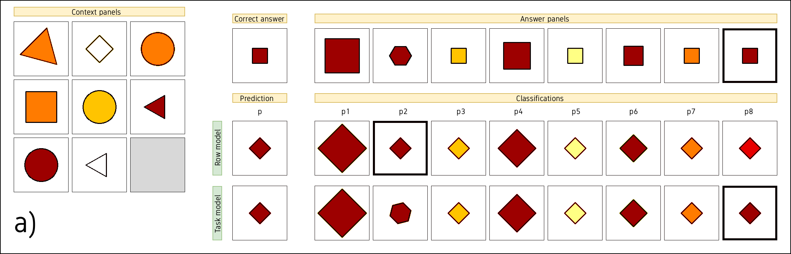
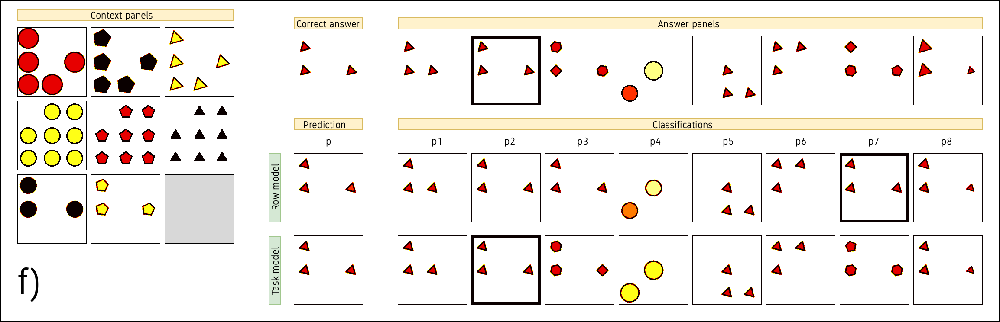
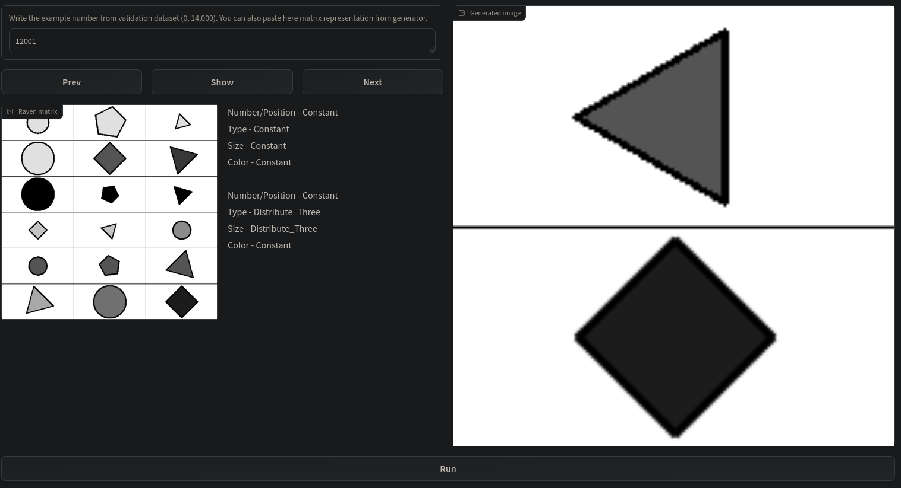

# Grid Transformer
The Grid Transformer is a research library that offers utilities for building transformer models for grid-like input data. This includes data samples that consist of sets of objects with relational relationships, such as Raven Matrices or Sudoku puzzles.

It was developed for research purposes by the Neurosymbolic Systems Lab at Poznan University of Technology.

For usage examples, please refer to the:
....

This library includes a few utilities that were either copied or modified from code examples published by the Keras community. The original code can be found on the Keras website at [keras.io/examples](https://keras.io/examples/). There are many useful resources on building transformers using Keras available on their website. 

Below are links to some of these helpful examples:

-  https://keras.io/examples/nlp/text_classification_with_transformer/
-  https://keras.io/examples/vision/image_classification_with_vision_transformer/
-  https://keras.io/examples/vision/deit/
-  https://keras.io/examples/vision/object_detection_using_vision_transformer/

## Getting started
### Installation
To get started with the tool, follow these installation instructions:
### Usage
...

## Projects/Publications
Research projects that use this tool:
...

## Comments
- The documentation was partly created by ChatGPT, a language model developed by OpenAI.
- This tool is licensed under the MIT License. Please see the `LICENSE` file for more information.
